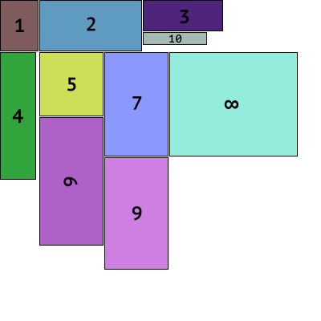
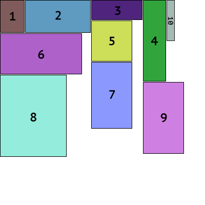

# texture-packer 

A library for texture packing

[How to contribute](https://github.com/PistonDevelopers/piston/blob/master/CONTRIBUTING.md)

# screenshots

## Shelf Packer

## Guillotine Packer

## Maxrect Packer

## Skyline Packer

## Dependencies

