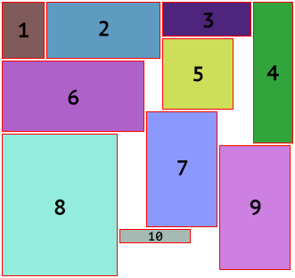
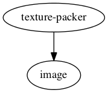

texture-packer [![Build Status]][Travis CI]
========
A texture packing library using the skyline heuristic. To test the sample code,
run the code below from the project directory. **[Documentation]**

```bash
# Be sure you're running this code at the root of the project directory!
cargo run --example packer-test
```

[How to contribute]



### Dependencies


### References
- L. Weia, D. Zhanga, and Q. Chena, "[A least wasted first heuristic algorithm for the rectangular packing problem](http://www.sciencedirect.com/science/article/pii/S0305054808000555)," *Comput. Oper. Res.*, vol. 36, no. 5, pp. 1608-1614, 2009.
- L. Weia, Wee-Chong Oona, W. Zhub, A. Lima, "[A skyline heuristic for the 2D rectangular packing and strip packing problems](http://www.sciencedirect.com/science/article/pii/S0377221711005510)," *Comput. Oper. Res.*, vol. 215, no. 2, pp. 337-346, 2011.

--------

[MIT License](LICENSE)

[Build Status]: https://travis-ci.org/PistonDevelopers/texture_packer.svg?branch=master
[Travis CI]: https://travis-ci.org/PistonDevelopers/texture_packer
[Documentation]: http://docs.piston.rs/texture_packer
[How to contribute]: https://github.com/PistonDevelopers/piston/blob/master/CONTRIBUTING.md
